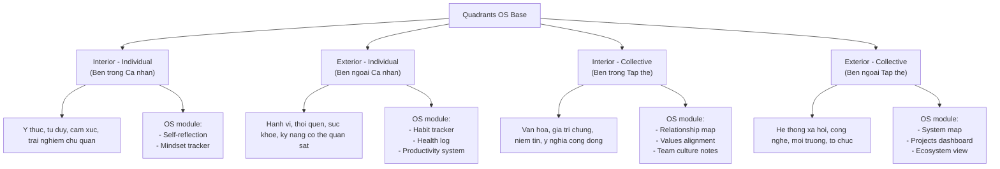
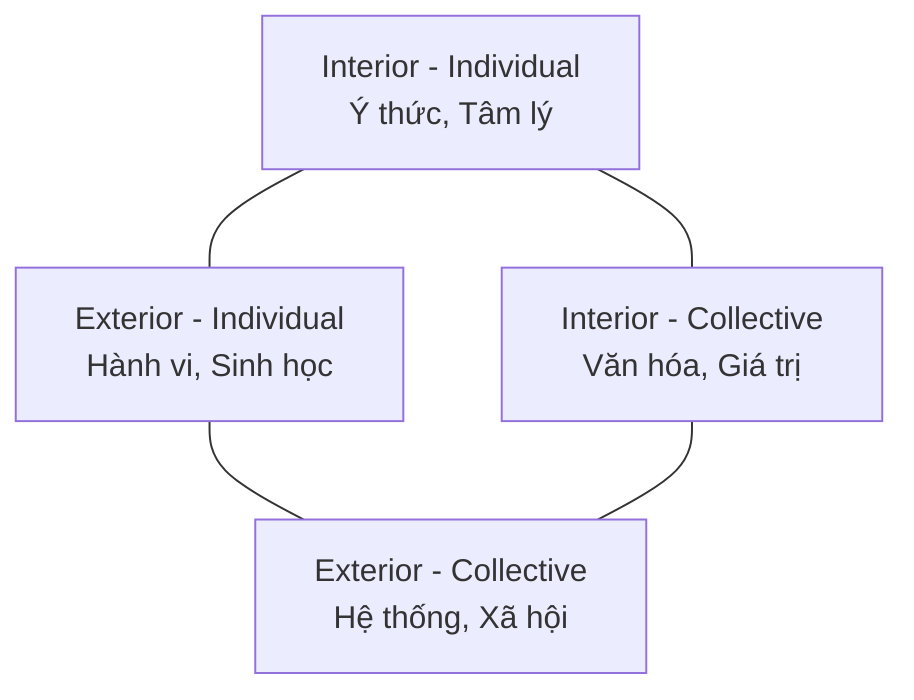

# Cốt lõi mô hình AQAL của Ken Wilber

**AQAL** là viết tắt của "All Quadrants, All Levels, All Lines, All States, All Types" (Tất cả các Góc phần tư, Tất cả các Cấp độ, Tất cả các Dòng, Tất cả các Trạng thái, Tất cả các Loại hình). Đây là một siêu-khung (meta-framework) của [[Thuyết Tích hợp]] (Integral Theory) do Ken Wilber phát triển, nhằm mục đích tích hợp và sắp xếp một cách có hệ thống sự đa dạng của các lý thuyết và mô hình từ nhiều lĩnh vực khác nhau của tri thức nhân loại.

Mô hình này cung cấp một tấm bản đồ toàn diện về thực tại, giúp chúng ta hiểu sâu sắc hơn về bản thân, văn hóa và thế giới. Cốt lõi của mô hình AQAL bao gồm 5 yếu tố không thể thiếu:

1. **[[Các góc phần tư (Quadrants)]]**: Bốn góc nhìn cơ bản về thực tại, đại diện cho các chiều kích chủ quan, khách quan, liên chủ quan và liên khách quan.
   - **Góc trên bên trái (UL - Upper Left - "Tôi")**: Thế giới nội tâm, chủ quan của cá nhân (suy nghĩ, cảm xúc, ý thức).
   - **Góc trên bên phải (UR - Upper Right - "Nó")**: Thế giới ngoại vi, khách quan của cá nhân (hành vi, cơ thể, vật chất).
   - **Góc dưới bên trái (LL - Lower Left - "Chúng ta")**: Thế giới nội tâm, liên chủ quan của tập thể (văn hóa, giá trị chung, thế giới quan).
   - **Góc dưới bên phải (LR - Lower Right - "Chúng nó")**: Thế giới ngoại vi, liên khách quan của tập thể (hệ thống xã hội, cấu trúc, môi trường).

2. **[[Các cấp độ (Levels)]]**: Các giai đoạn phát triển hoặc các nấc thang của ý thức. Các cấp độ này thể hiện sự phức tạp và chiều sâu ngày càng tăng. Ví dụ điển hình là các cấp độ trong mô hình [[Spiral Dynamics]].

3. **[[Các dòng (Lines)]]**: Các dòng phát triển hoặc các loại hình trí thông minh khác nhau. Con người không phát triển đồng đều ở mọi khía cạnh. Chúng ta có thể có dòng nhận thức rất phát triển, nhưng dòng cảm xúc lại kém hơn. Ví dụ: dòng nhận thức, dòng cảm xúc, dòng đạo đức, dòng tương tác xã hội.

4. **[[Các trạng thái (States)]]**: Các trạng thái ý thức tạm thời và có thể thay đổi. Chúng đến rồi đi. Ví dụ: trạng thái thức, mơ, ngủ sâu; hoặc các trạng thái thiền định, trải nghiệm đỉnh cao.

5. **[[Các loại hình (Types)]]**: Các phong cách hoặc đặc điểm tương đối ổn định, không phụ thuộc vào cấp độ phát triển. Ví dụ: loại hình nam tính/nữ tính, các loại hình trong Enneagram, hoặc MBTI.

Bằng cách áp dụng cả năm yếu tố này, phương pháp tiếp cận Tích hợp (Integral Approach) của Ken Wilber cố gắng đưa ra một cái nhìn toàn diện và cân bằng hơn, tránh việc chỉ tập trung vào một góc nhìn duy nhất mà bỏ qua các khía cạnh quan trọng khác của thực tại.

---

## Hình minh hoạ & Diagram

[[../6. Vault/archived/AQAL]]
