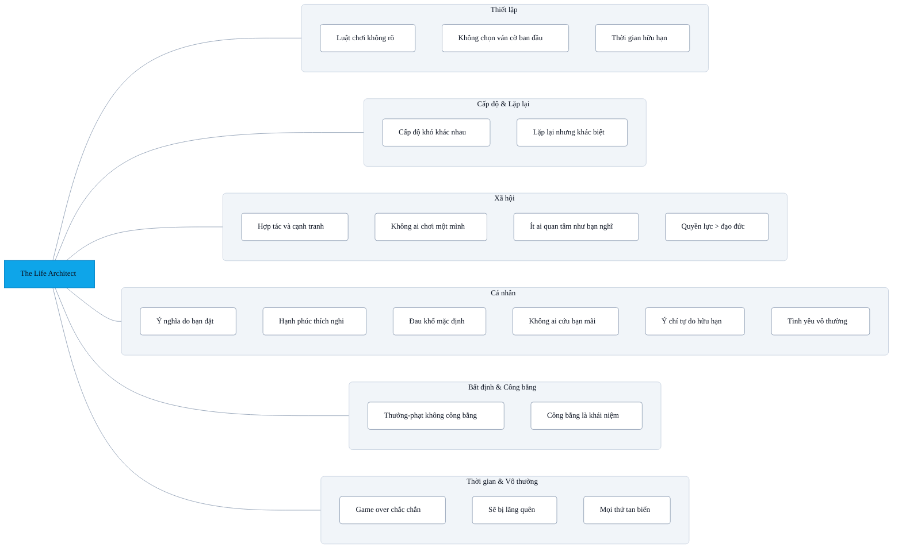

## Sơ đồ tổng quan

Xây dựng 1 kế hoạch dài hạn là 1 điều tất yếu của trò chơi cuộc sống này. Nơi gần như mỗi ngày mai là 1 chặng mới để khám phá. Cuộc sống được thiết kế để người chơi bị thu hút bởi các yếu tố ngắn hạn mà bỏ qua các yếu tố dài hạn.

### Một vài quy tắc phổ quát

---

### 1. Luật chơi không ai viết rõ ràng

- Không có “sách hướng dẫn” chính thức.
- Mỗi nền văn hóa, tôn giáo, triết học đưa ra bộ quy tắc khác nhau.
- Bạn phải vừa chơi vừa học luật.

---

### 2. Bạn không chọn ván cờ ban đầu

- Bạn không chọn nơi sinh, cha mẹ, hoàn cảnh.
- Nhưng bạn có thể chọn cách chơi với những lá bài được phát.

---

### 3. Thời gian là tài nguyên duy nhất không thể nạp thêm

- Tiền, kiến thức, sức khỏe có thể mất rồi lấy lại.
- Thời gian trôi thì không quay ngược được.

---

### 4. Cấp độ khó khác nhau cho mỗi người

- Có người sinh ra ở “easy mode”, có người ở “hard mode”.
- So sánh quá nhiều thường khiến ta quên mất bản đồ riêng mình.

---

### 5. Trò chơi này vừa là hợp tác vừa là cạnh tranh

- Bạn phải hợp tác để tồn tại (ăn, ở, xã hội).
- Nhưng cũng cạnh tranh để tiến lên (công việc, vị thế).
- Chìa khóa: biết khi nào cần liên minh, khi nào cần tự lập.

---

### 6. Ý nghĩa không có sẵn, mà do bạn đặt vào

- Có thể coi đời là một trò đùa, một hành trình, một trường học, một giấc mơ.
- Cách bạn định nghĩa sẽ quyết định cách bạn chơi.

---

### 7. “Game over” là chắc chắn

- Không ai thắng mãi.
- Cái chết là phần không thể tránh, nhưng nhiều người cố gắng quên đi.

---

### 8. Hệ thống thưởng – phạt không luôn công bằng

- Người tốt không phải lúc nào cũng được “thắng”.
- Người xấu không phải lúc nào cũng bị “thua”.
- Sự bất định chính là một phần của trò chơi.

---

### 9. Trò chơi mang tính lặp lại nhưng không hề giống hệt

- Ngày hôm nay có thể giống hôm qua, nhưng vẫn có biến số mới.
- Mỗi quyết định nhỏ có thể mở ra nhánh chơi hoàn toàn khác.

---

### 10. Không ai thực sự chơi một mình

- Người khác là NPC trong mắt bạn, nhưng trong trò chơi của họ, bạn cũng chỉ là NPC.
- Thế giới là mạng lưới các trò chơi đan xen.

---

### 11. Không ai thực sự quan tâm nhiều đến bạn như bạn nghĩ

- Mỗi người chủ yếu tập trung vào “ván chơi” của riêng họ.
- Điều này vừa cô đơn, vừa giải phóng: bạn ít bị để ý hơn bạn tưởng.

---

### 12. Hạnh phúc không bền

- Niềm vui nào rồi cũng nhạt.
- Não người được thiết kế để “quen đi” (hedonic adaptation).
- Vì thế, chạy theo hạnh phúc thuần túy là vòng lặp vô tận.

---

### 13. Đau khổ là một phần mặc định

- Ai cũng sẽ nếm trải bệnh tật, mất mát, thất vọng.
- Không có “chế độ miễn khổ”, chỉ có cách đối diện và biến đổi nó.

---

### 14. Quyền lực và tiền bạc quyết định nhiều hơn đạo đức

- Trật tự xã hội vận hành theo sức mạnh thực tế, không chỉ dựa trên “công lý”.
- Người có quyền thường viết luật, người không có thì phải thích nghi.

---

### 15. Tình yêu không phải lúc nào cũng vĩnh cửu

- Hormone, nhu cầu, và hoàn cảnh thay đổi.
- Rất nhiều mối quan hệ tan vỡ không vì ai sai, mà vì game đã sang “map” khác.

---

### 16. Không có ai “cứu” bạn mãi được

- Cha mẹ, thầy cô, bạn bè, người yêu… đều có giới hạn.
- Đến lúc nào đó, bạn phải chịu trách nhiệm cho trò chơi của mình.

---

### 17. Ý chí tự do có giới hạn

- Nhiều quyết định “tự do” thực ra bị chi phối bởi gen, môi trường, tiềm thức.
- Ta không hoàn toàn làm chủ như ta tưởng.

---

### 18. Bạn sẽ bị lãng quên

- Sau một, hai thế hệ, hầu hết mọi người sẽ không còn nhớ bạn.
- Trừ số rất ít để lại dấu ấn lớn.

---

### 19. “Công bằng” chỉ là khái niệm con người bịa ra

- Vũ trụ không quan tâm đến công bằng.
- Công bằng là mong muốn xã hội tạo ra để bớt hỗn loạn, chứ không phải quy luật tự nhiên.

---

### 20. Cuối cùng, mọi thứ tan biến

- Cơ thể, ký ức, công trình, thậm chí cả loài người rồi cũng sẽ biến mất.
- Trò chơi này không có “save file vĩnh viễn”.

---
