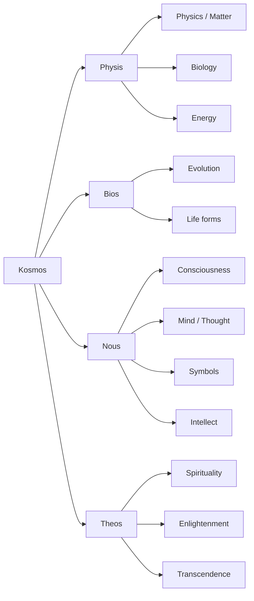

---
aliases:
  - A Brief History Of Everything
created: 2025-08-27 11:09:24
progress: raw
blueprint:
  - "[[../../4. Blueprint/Reading Challenges|Reading Challenges]]"
impact:
tags:
  - book
  - highlight
category:
  - reading
  - Philosophy
  - Methodology
author:
  - Ken Wilber
edition:
start: 2025-08-27
end: 2025-08-31
summary: Ken Wilber’s A Brief History of Everything is a conversational introduction to his “Integral Theory,” which attempts to unify science, psychology, spirituality, culture, and evolution into one coherent framework.
cover: https://m.media-amazon.com/images/I/81cJo4m4cIL._SY466_.jpg
---

## Executive summary

## Key takeaways

"A Brief History of Everything is not literally a history of all things, but a map for integrating knowledge and experience—pointing toward a holistic, evolutionary future."

Theo Ken Wilber, khái niệm **“hoàn vũ” (Kosmos)** không chỉ đơn giản là **“vũ trụ vật chất” (cosmos)** như khoa học tự nhiên thường hiểu, mà là một **tổng thể toàn diện gồm nhiều chiều kích của thực tại**.

---

## 1. **Kosmos ≠ Cosmos**

- **Cosmos** (theo nghĩa thông thường): vũ trụ vật chất, không gian, năng lượng, các định luật vật lý.
    
- **Kosmos** (Wilber dùng chữ Hy Lạp cổ): bao trùm **toàn bộ các chiều kích tồn tại** – vật chất, sự sống, tâm trí, văn hóa, tinh thần.
    

---

## 2. **Các chiều kích trong “Hoàn vũ”**

**Các tầng:**
1. **Physis (Vật chất):** thế giới vật lý, sinh học, năng lượng  
2. **Bios (Sự sống):** tiến hóa sinh học, các dạng sống  
3. **Nous (Tâm trí):** ý thức, tư duy, biểu tượng, trí tuệ  
4. **Theos (Tinh thần):** chiều tâm linh, giác ngộ, siêu việt  

---
## 3. **Tính chất của Hoàn vũ theo Wilber**

- **Holonic:** mọi thực thể đều vừa là một “toàn thể” vừa là “bộ phận” (Holon).
    
- **Evolving:** Hoàn vũ là một quá trình tiến hóa – từ vật chất → sự sống → ý thức → tinh thần.
    
- **Integral:** không có tầng nào bị loại bỏ, tất cả được **“transcend and include”** (vượt lên và bao hàm).

---

## 4. **Ý nghĩa triết học**

- Wilber muốn chống lại **chủ nghĩa duy vật giản lược**, vốn coi vũ trụ chỉ là “các hạt và định luật”.
    
- “Hoàn vũ” của ông là một **bức tranh toàn thể**, nơi mà khoa học, tâm lý, xã hội, nghệ thuật, và tâm linh đều có chỗ đứng hợp pháp.

---

[AQAL](../archived/AQAL.md)

## TOC

**Phần 1: Tinh Thần trong quá trình diễn hoá:**

1. Mô Hình Kết Nối
2. Sinh mạch bí ẩn
3. Về vấn đề con người
4. Đại cách mạng hậu hiện đại
5. Bốn góc của Hoàn Vũ
6. Hai tay của Thượng Đế
7. Thích nghi với Hoàn Vũ
8. Chân, Thiện, Mỹ
